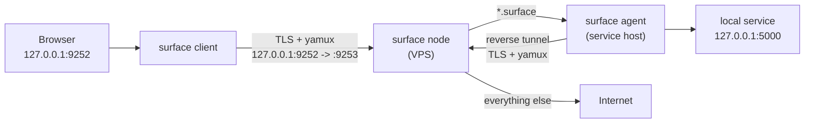

# Surface

[](https://go.dev)
[](#license)
[](#building-from-source)

**Surface** is a lightweight, self-hosted private network of `.surface` addresses — a simpler,
non-anonymous alternative to Tor's hidden services. A single cross-platform static Go binary acts as
the network gateway (on a VPS), the service publisher, and the local proxy for your browser.

- A local SOCKS5/HTTP proxy on `127.0.0.1:9252` routes **`*.surface`** names to internal services and
  **everything else** to the internet through your node.
- Addresses are derived from an ed25519 key, so publishing a service requires no public IP, no
  port-forwarding, and no DNS.
- There is **no onion routing**: it's a single hop. The node sees the traffic. Surface is about
  *private reachability*, not anonymity.

> ⚠️ Surface is a young project. Review the [security model](#security-model) before exposing it.

---

## How it works



### Roles

| Role | Where it runs | What it does |
| --- | --- | --- |
| **node** | your VPS (public IP) | Directory + registry, internet exit, TLS tunnel listener on `:9253` |
| **agent** | wherever the service runs | Opens a reverse tunnel, publishes `*.surface` names, heartbeats |
| **client** | your computer / phone | Local SOCKS5/HTTP proxy on `127.0.0.1:9252`, forwards to the node |
| **combined** | default (no subcommand) | Runs **client + agent together** in one process, Tor-like |

### Default ports

| Port | Purpose |
| --- | --- |
| `9253/tcp` | Node tunnel listener (the only publicly exposed port) |
| `9252/tcp` | Local proxy (SOCKS5 + HTTP, auto-detected), loopback only |
| `9292/tcp` | Node health endpoint `/healthz`, loopback only |

---

## Features

- **One static binary** for Linux and Windows (`CGO_ENABLED=0`), no runtime dependencies.
- **Reverse tunnels** using TLS + [yamux](https://github.com/hashicorp/yamux) stream multiplexing.
- **ed25519 authentication** for every client/agent connection.
- **`.surface` names derived from the ed25519 public key** (16-char base32) — no collisions, no
  name squatting.
- **Multiple identities per agent** (torrc-like): publish several `.surface` addresses from one
  process, each with its own key and ports.
- **Embedded node certificate + public-key pinning**: clients/agents verify the node without a
  download and without `tls_skip_verify`.
- **Client/agent authorization**: close the network to only the keys you approve.
- **SQLite registry with WAL** (pure-Go driver), automatic migrations on startup.
- **Tor-like default**: run with no subcommand to get client + agent simultaneously.

---

## Quick start

### 1. Node on your VPS

Generate a config, then run the node:

```bash
./surface --config settings.json     # writes a default settings.json if missing
# edit settings.json: set "role": "node", "tunnel_listen": "0.0.0.0:9253"
./surface node --config settings.json
```

Open `9253/tcp` in the firewall. The node writes `certs/node.crt` and `certs/node.key` on first run.

### 2. Client + agent on your computer

Use the all-in-one example and point `node_addr` at your VPS:

```bash
cp settings.all-in-one.example.json settings.json
# edit settings.json:
#   "node_addr": "YOUR_VPS_IP:9253"
#   "hidden_services": [ ... ]
./surface --config settings.json     # combined: local proxy + published services
```

### 3. Browser (Firefox)

Settings → Network Settings → Manual proxy configuration:

- **SOCKS5** host `127.0.0.1`, port `9252`
- Enable **"Proxy DNS when using SOCKS v5"** (required so `.surface` names reach the proxy).

Now `http://example.com` goes out through your node, and
`http://<id>.surface/` reaches your internal service.

> The node certificate is embedded in the binary and verified by public-key pinning. If you keep
> external certs, point `tls_ca_file` at the node's `node.crt`. `tls_skip_verify` exists for testing
> only — it disables node authentication.

### 4. Android (Termux)

A self-contained installer downloads the `linux/arm64` binary, verifies its SHA-256, writes the
config, sets up `termux-wake-lock` and `Termux:Boot` autostart, and starts the client:

```bash
pkg install -y curl && curl -fsSL https://YOUR_HOST/surface/install.sh -o ~/surface-install.sh && bash ~/surface-install.sh
```

Host `surface` (the arm64 binary), `SHA256SUMS`, and `install.sh` under the URL in
`install/termux/install.sh`.

---

## Command-line reference

```text
surface            [--config settings.json]   # client + agent (default, Tor-like)
surface node       [--config settings.json]
surface agent      [--config settings.json]
surface client     [--config settings.json]
surface node allow <public_key> [--role agent|client] [--config settings.json]
surface agent  id  [--config settings.json]
surface client id  [--config settings.json]
```

- `id` prints the device public key (and the derived `.surface` name for agents).
- `node allow` authorizes a client or agent key; the effect is immediate (no restart).

---

## Configuration

A single `settings.json` can be used for both combined and node modes. `role` in the file is only a
default — the CLI subcommand always wins. See
[`settings.all-in-one.example.json`](settings.all-in-one.example.json).

### Client / combined

| Field | Default | Description |
| --- | --- | --- |
| `node_addr` | `127.0.0.1:9253` | Node tunnel address (`ip:port` or `host:port`) |
| `proxy_listen` | `127.0.0.1:9252` | Local SOCKS5/HTTP proxy listen address |
| `tls_ca_file` | `certs/node.crt` | Node certificate (extracted from the binary if missing) |
| `tls_skip_verify` | `false` | Disable node authentication (testing only) |
| `client_key_file` | `keys/client.key` | Client ed25519 identity |
| `aliases` | `{}` | Local `name.surface -> id.surface` aliases |
| `identity_dir` | `identity` | Default agent identity directory |
| `hidden_services` | `[]` | Services to publish (see below) |
| `heartbeat_seconds` | `15` | Registry refresh interval |

### Agent services (`hidden_services[]`)

| Field | Description |
| --- | --- |
| `alias` | Local label (logs only) |
| `identity_dir` | Key directory; **same dir = same address**, different dir = different address |
| `virtual_port` | Public port on the `.surface` address |
| `target` | Local service to forward to (`host:port`) |

### Node

| Field | Default | Description |
| --- | --- | --- |
| `db_name` | `surface.db` | SQLite registry (WAL) |
| `tunnel_listen` | `0.0.0.0:9253` | Public tunnel listener |
| `proxy_listen` | `127.0.0.1:9252` | Optional local proxy on the node |
| `health_listen` | `127.0.0.1:9292` | `/healthz` endpoint (`""` disables) |
| `tls_cert_file` / `tls_key_file` | `certs/node.crt` / `certs/node.key` | Node identity (auto-generated) |
| `dns_servers` | `1.1.1.1:53`, `8.8.8.8:53` | Upstream resolvers for internet traffic |
| `heartbeat_timeout_seconds` | `45` | Session timeout |
| `allowed_agents` | `[]` | Static agent allowlist (`[]` = open registration) |

---

## `.surface` naming

Names are derived from the ed25519 public key:

```
id   = base32_lower( sha256(public_key)[:10] )   // 16 characters
name = id + ".surface"                            // e.g. k3f9x2q7v1a5b7c9.surface
```

The agent writes the result to `identity_dir/hostname`. The node verifies that the registered name
matches the connecting key, so no one can impersonate or squat an address.

**Multiple addresses per agent** work like `torrc`'s `HiddenServiceDir`:

```json
"hidden_services": [
  { "alias": "blog", "identity_dir": "identity/blog", "virtual_port": 80, "target": "127.0.0.1:5000" },
  { "alias": "api",  "identity_dir": "identity/api",  "virtual_port": 80, "target": "127.0.0.1:9000" }
]
```

Same `identity_dir` with several `virtual_port` entries = one address, multiple ports.

---

## Security model

- **The node is trusted.** There is no onion routing; the node terminates the tunnel and sees the
  plaintext of `.surface` traffic (use HTTPS on your services if that matters).
- **`certs/node.key` is the crown jewel.** Keep it secret (permissions `0600`, encrypted backup,
  never in the repo or in distributed binaries). If it leaks, regenerate it and rebuild/redistribute
  client and agent binaries.
- **`certs/node.crt` is public** and safe to share/distribute. Clients pin its public key, so a copy
  of the certificate alone cannot be used to impersonate the node.
- **Changing the node IP** does not break anything as long as you move `node.crt` + `node.key` along:
  only `node_addr` (ideally a DNS name) needs updating. Identities are pinned by key, not by IP.
- **TCP only.** The proxy implements SOCKS5 CONNECT and HTTP CONNECT/absolute-URI. UDP/QUIC is not
  supported.
- **Close the network** by authorizing keys with `surface node allow ... --role agent|client`.

---

## Building from source

```bash
go build -o surface .                       # host platform

# cross-compile (no C toolchain required)
GOOS=linux   GOARCH=amd64 CGO_ENABLED=0 go build -o dist/surface-linux-amd64 .
GOOS=linux   GOARCH=arm64 CGO_ENABLED=0 go build -o dist/surface-linux-arm64 .
GOOS=windows GOARCH=amd64 CGO_ENABLED=0 go build -o dist/surface-windows-amd64.exe .
GOOS=windows GOARCH=386   CGO_ENABLED=0 go build -o dist/surface-windows-386.exe .
```

A [goreleaser](https://goreleaser.com) configuration is provided (`.goreleaser.yaml`).

> Requires a recent Go toolchain (`go.mod` pins the version).

---

## Testing

```bash
gofmt -l .
go vet ./...
go test ./...
```

Tests cover the registry, ed25519 name derivation, certificate pinning, client authorization,
multi-identity agents, and an end-to-end tunnel (node + agent + client) using in-memory HTTP
services.

---

## Repository layout

```text
main.go              CLI dispatch, config, graceful shutdown
run.go               combined mode (client + agent)
settings.go          settings.json model and defaults
structs.go db.go     GORM models + SQLite (WAL) setup and migrations
registry.go          service/key registry over GORM
identity.go cert.go  ed25519 identities, derived names, certificate pinning
tunnel.go sessions.go TLS + yamux transport, handshake, session manager
node.go              node role: listener, routing, internet exit
agent.go             agent role: identities, registration, reverse tunnels
client.go proxy.go socks5.go httpproxy.go exit.go  local proxy and forwarding
health.go assets.go  health endpoint and embedded assets
surface_test.go      unit + end-to-end tests
install/termux/      Termux installer (install.sh, start.sh, uninstall.sh)
```

---

## Roadmap

- UDP ASSOCIATE (QUIC and UDP services).
- Multiple trusted node public keys for zero-rebuild rotation.
- Optional node-signed handshake (app-layer node authentication).
- Standalone DNS responder for `.surface` inside a VPN.

---

## License

MIT. If you use this project, add a `LICENSE` file with the corresponding text. Contributions and
issues are welcome.
