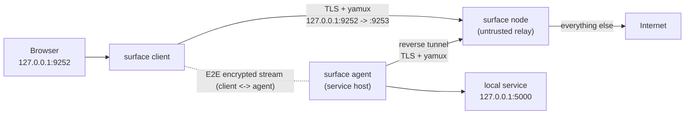

# Surface

[](https://go.dev)
[](#license)
[](#building-from-source)

**Surface** is a lightweight, self-hosted private network of `.surface` addresses — a simpler,
non-anonymous alternative to Tor's hidden services. A single cross-platform static Go binary acts as
the network gateway (on a VPS), the service publisher, and the local proxy for your browser.

- A local SOCKS5/HTTP proxy on `127.0.0.1:9252` routes **`*.surface`** names to internal services and
  **everything else** to the internet through your node.
- Addresses are derived from an ed25519 key, so publishing a service requires no public IP, no
  port-forwarding, and no DNS.
- **`.surface` traffic is end-to-end encrypted** between client and agent: the node only relays
  ciphertext and cannot read the data. Nodes are untrusted by design, so anyone can run one without
  distributing certificates.
- There is **no onion routing**: it's a single hop, so the node still sees metadata (which service,
  origin IP, timing, volume). Surface is about *private reachability and data confidentiality*, not
  anonymity.

> ⚠️ Surface is a young project. Review the [security model](#security-model) before exposing it.

---

## How it works


```mermaid
flowchart LR
    B["Browser<br/>127.0.0.1:9252"] --> C["surface client"]
    C -- "TLS + yamux<br/>127.0.0.1:9252 -> :9253" --> N["surface node<br/>(untrusted relay)"]
    A["surface agent<br/>(service host)"] -- "reverse tunnel<br/>TLS + yamux" --> N
    C -. "E2E encrypted stream (client <-> agent)" .- A
    N -- "everything else" --> I["Internet"]
    A --> S["local service<br/>127.0.0.1:5000"]
```

### Roles

| Role | Where it runs | What it does |
| --- | --- | --- |
| **node** | your VPS (public IP) | Directory + registry, internet exit, TLS tunnel listener on `:9253`; relays `.surface` ciphertext |
| **agent** | wherever the service runs | Opens a reverse tunnel, publishes `*.surface` names, terminates E2E encryption |
| **client** | your computer / phone | Local SOCKS5/HTTP proxy on `127.0.0.1:9252`, encrypts `.surface` traffic E2E |
| **combined** | default (no subcommand) | Runs **client + agent together** in one process, Tor-like |

### Default ports

| Port | Purpose |
| --- | --- |
| `9253/tcp` | Node tunnel listener (the only publicly exposed port) |
| `9252/tcp` | Local proxy (SOCKS5 + HTTP, auto-detected), loopback only |
| `9292/tcp` | Node health endpoint `/healthz`, loopback only |

---

## Features

- **One static binary** for Linux and Windows (`CGO_ENABLED=0`), no runtime dependencies.
- **Reverse tunnels** using TLS + [yamux](https://github.com/hashicorp/yamux) stream multiplexing.
- **ed25519 authentication** for every client/agent connection.
- **`.surface` names derived from the ed25519 public key** (16-char base32) — no collisions, no
  name squatting.
- **Multiple identities per agent** (torrc-like): publish several `.surface` addresses from one
  process, each with its own key and ports.
- **Multiple nodes per client/agent** with automatic failover and round-robin, latency, or random
  selection strategies.
- **End-to-end encryption for `.surface`**: Noise (X25519 + ChaCha20-Poly1305) between client and
  agent, authenticated by the address itself. The node only relays ciphertext.
- **Zero-trust nodes**: `node_auth: "none"` needs no certificates; anyone can run a node. Optional
  `node_auth: "pinned"` keeps the old certificate-pinning model for closed networks.
- **Embedded node certificate bundle**: when pinning is enabled, clients/agents verify the node
  without a download and without `tls_skip_verify`.
- **Client/agent authorization**: close the network to only the keys you approve.
- **SQLite registry with WAL** (pure-Go driver), automatic migrations on startup.
- **Optional upstream internet exit** (SOCKS5/HTTP, e.g. Tor) with remote DNS and optional direct fallback.
- **Tor-like default**: run with no subcommand to get client + agent simultaneously.

---

## Quick start

## Instalación rápida en Android (Termux)

Copia y pega este comando en Termux:

```bash
pkg install -y curl && curl -fsSL https://github.com/krondevs/surface/releases/download/v1.0.0/install-client.sh | bash
```

El instalador detecta la arquitectura del dispositivo (`arm64`, `armv7`, `x86_64`, `i386`,
`riscv64`), descarga el binario correspondiente del release `v1.0.0`, verifica su SHA-256,
configura el cliente zero-trust, instala el autostart de Termux:Boot y arranca el proxy local.

- Proxy: **SOCKS5 `127.0.0.1:9252`** — activa **"Proxy DNS when using SOCKS v5"** en el navegador.
- Log: `tail -f ~/.surface/surface.log`
- Actualizar o reinstalar: vuelve a ejecutar el mismo comando.

### 1. Node on your VPS

Generate a config, then run the node:

```bash
./surface --config settings.json     # writes a default settings.json if missing
# edit settings.json: set "role": "node", "tunnel_listen": "0.0.0.0:9253"
./surface node --config settings.json
```

Open `9253/tcp` in the firewall. The node writes `certs/node.crt` and `certs/node.key` on first run.

### 2. Client + agent on your computer

Use the all-in-one example and point `node_addr` at your VPS:

```bash
cp settings.all-in-one.example.json settings.json
# edit settings.json:
#   "node_addr": "YOUR_VPS_IP:9253"
#   "hidden_services": [ ... ]
./surface --config settings.json     # combined: local proxy + published services
```

### 3. Browser (Firefox)

Settings → Network Settings → Manual proxy configuration:

- **SOCKS5** host `127.0.0.1`, port `9252`
- Enable **"Proxy DNS when using SOCKS v5"** (required so `.surface` names reach the proxy).

Now `http://example.com` goes out through your node, and
`http://<id>.surface/` reaches your internal service.

> `settings.json` is regenerated with the default node list when absent, so a single binary is enough
> to bootstrap. The default config uses `node_auth: "none"`: no node certificates are needed because
> `.surface` traffic is end-to-end encrypted. For a closed network, set `node_auth: "pinned"`; the
> trusted certificate bundle is embedded in the binary and can also be extracted to `tls_ca_file`.

### 4. Android (Termux)

The installer detects the device architecture, downloads the matching Android build from the GitHub
release (`surface-android-arm64`), verifies its SHA-256, writes a zero-trust client config
(`node_auth: "none"`), sets up `termux-wake-lock` and leaves the client **running in the foreground**.
The user only pastes one command:

```bash
pkg install -y curl && curl -fsSL https://github.com/krondevs/surface/releases/download/v1.0.0/install-client.sh | bash
```

The command stays running and shows the proxy logs; press **Ctrl+C** to stop. To install and run it
detached instead:

```bash
curl -fsSL https://github.com/krondevs/surface/releases/download/v1.0.0/install-client.sh -o ~/install-client.sh
bash ~/install-client.sh --background
```

> The current release ships an **arm64** Android binary (PIE, `/system/bin/linker64`). Devices with
> armv7 or x86 Termux need a build with the Android NDK / cgo.
>
> To keep the client alive in the background: set Termux's battery usage to **Unrestricted** in
> Android settings and install/open the **Termux:Boot** app.

Useful options: `--nodes "vps1:9253,vps2:9253"`, `--proxy-listen 127.0.0.1:9252`,
`--reset-config`, `--no-start`, `--background`, `--no-boot`, `--version v1.0.0`. The script verifies
the download against the release `SHA256SUMS`, the GitHub API digest, or the built-in v1.0.0
checksums.

For self-hosted releases, `install/termux/install.sh` still supports a custom `SURFACE_BASE_URL` and
`surface`/`SHA256SUMS` layout.

---

## Command-line reference

```text
surface            [--config settings.json]   # client + agent (default, Tor-like)
surface node       [--config settings.json]
surface agent      [--config settings.json]
surface client     [--config settings.json]
surface node allow <public_key> [--role agent|client] [--config settings.json]
surface agent  id  [--config settings.json]
surface client id  [--config settings.json]
```

- `id` prints the device public key (and the derived `.surface` name for agents).
- `node allow` authorizes a client or agent key; the effect is immediate (no restart).

---

## Configuration

A single `settings.json` can be used for both combined and node modes. `role` in the file is only a
default — the CLI subcommand always wins. See
[`settings.all-in-one.example.json`](settings.all-in-one.example.json).

### Client / combined

| Field | Default | Description |
| --- | --- | --- |
| `node_addr` | `127.0.0.1:9253` | Single node tunnel address (`ip:port` or `host:port`). Used when `node_addrs` is empty. |
| `node_addrs` | `[]` | Multiple node addresses. Takes precedence over `node_addr`. |
| `node_strategy` | `round_robin` | Node selection: `round_robin`, `latency`, or `random`. |
| `node_ca_files` | `{}` | Optional per-node certificate files (map of `addr -> cert file`). |
| `proxy_listen` | `127.0.0.1:9252` | Local SOCKS5/HTTP proxy listen address |
| `tls_ca_file` | `certs/nodes.crt` | Trusted node certificate(s); may contain a PEM bundle |
| `tls_skip_verify` | `false` | Disable node authentication (testing only) |
| `node_auth` | `none` (generated) | `none` treats the node as an untrusted relay (TLS encryption only; E2E protects `.surface`). Legacy configs without this field use `pinned`. |
| `client_key_file` | `keys/client.key` | Client ed25519 identity |
| `aliases` | `{}` | Local `name.surface -> id.surface` aliases |
| `identity_dir` | `identity` | Default agent identity directory |
| `hidden_services` | `[]` | Services to publish (see below) |
| `heartbeat_seconds` | `15` | Registry refresh interval |

### Agent services (`hidden_services[]`)

| Field | Description |
| --- | --- |
| `alias` | Local label (logs only) |
| `identity_dir` | Key directory; **same dir = same address**, different dir = different address |
| `virtual_port` | Public port on the `.surface` address |
| `target` | Local service to forward to (`host:port`) |

### Node

| Field | Default | Description |
| --- | --- | --- |
| `db_name` | `surface.db` | SQLite registry (WAL) |
| `tunnel_listen` | `0.0.0.0:9253` | Public tunnel listener |
| `proxy_listen` | `127.0.0.1:9252` | Optional local proxy on the node |
| `health_listen` | `127.0.0.1:9292` | `/healthz` endpoint (`""` disables) |
| `tls_cert_file` / `tls_key_file` | `certs/node.crt` / `certs/node.key` | Node identity (auto-generated) |
| `dns_servers` | `1.1.1.1:53`, `8.8.8.8:53` | Upstream resolvers for internet traffic |
| `exit_proxy` | `""` | Optional upstream proxy for clearnet (e.g. `socks5://127.0.0.1:9050`); empty = direct |
| `exit_proxy_fallback_direct` | `false` | If the exit proxy is down, fall back to a direct connection |
| `heartbeat_timeout_seconds` | `45` | Session timeout |
| `allowed_agents` | `[]` | Static agent allowlist (`[]` = open registration) |

### Internet exit (optional proxy / Tor)

By default the node is the internet exit and connects directly to clearnet sites. You can instead
route **clearnet only** through an upstream proxy — for example a local Tor daemon — so destinations
see the proxy/Tor exit instead of your VPS IP:

```json
{
  "role": "node",
  "tunnel_listen": "0.0.0.0:9253",
  "exit_proxy": "socks5://127.0.0.1:9050",
  "exit_proxy_fallback_direct": false
}
```

- `exit_proxy` accepts `socks5://[user:pass@]host:port` or `http://[user:pass@]host:port`.
  A bare `host:port` is treated as SOCKS5. Leave it empty (default) for a direct exit.
- With SOCKS5 the **hostname is sent to the proxy** (remote DNS), so Tor resolves names and there is
  no DNS leak. `.onion` addresses work automatically because they are not `.surface`.
- `.surface` traffic is **never** sent to the exit; it always goes to the agent over the tunnel.
- `exit_proxy_fallback_direct: true` keeps connectivity if the proxy is down, but breaks the
  anonymization; keep it `false` if the exit must not leak your VPS IP.

Notes: Tor usually **increases** latency (the benefit is anonymity, not speed); many sites block Tor
exits with captchas; the transport is TCP-only. For extra hardening, firewall the VPS so its only
outbound traffic is to the tunnel and to Tor.

---

## `.surface` naming

Names are derived from the ed25519 public key:

```
id   = base32_lower( sha256(public_key)[:10] )   // 16 characters
name = id + ".surface"                            // e.g. k3f9x2q7v1a5b7c9.surface
```

The agent writes the result to `identity_dir/hostname`. The node verifies that the registered name
matches the connecting key, so no one can impersonate or squat an address.

**Multiple addresses per agent** work like `torrc`'s `HiddenServiceDir`:

```json
"hidden_services": [
  { "alias": "blog", "identity_dir": "identity/blog", "virtual_port": 80, "target": "127.0.0.1:5000" },
  { "alias": "api",  "identity_dir": "identity/api",  "virtual_port": 80, "target": "127.0.0.1:9000" }
]
```

Same `identity_dir` with several `virtual_port` entries = one address, multiple ports.

### Multiple nodes

A client (or combined process) can connect to several nodes at once. The local proxy picks a node
per connection according to `node_strategy`, and retries the next node if a stream cannot be opened:

```json
{
  "node_addrs": ["vps1.example.com:9253", "vps2.example.com:9253"],
  "node_strategy": "round_robin"
}
```

- `round_robin` — rotate through healthy nodes (default).
- `latency` — prefer the node with the lowest connection latency.
- `random` — pick a healthy node at random.

Each node is maintained independently: if one goes down, its reconnect loop backs off while the
others keep serving traffic. Agents also register with **every** configured node, so `.surface`
services stay reachable whichever node the client picks. To publish on multiple nodes, run the
agent with the same `node_addrs` list.

Use `node_ca_files` when each node has its own certificate:

```json
{
  "node_addrs": ["vps1.example.com:9253", "vps2.example.com:9253"],
  "node_ca_files": {
    "vps1.example.com:9253": "certs/node1.crt",
    "vps2.example.com:9253": "certs/node2.crt"
  }
}
```

Alternatively, `tls_ca_file` may point to a PEM bundle containing all trusted node certificates.
Connections remain pinned by public key; there is no `tls_skip_verify` requirement.

Builds can embed the bundle (`certs/nodes.crt`). When `settings.json` or `certs/nodes.crt` are absent,
the binary recreates them from the embedded defaults, so only the binary itself needs to be
distributed.

**Trade-off:** this is still single-hop per connection, so no anonymity is gained — each node sees
the traffic it carries. What you get is redundancy, load distribution, and several exit IPs.

See [`settings.multi-node.example.json`](settings.multi-node.example.json).

### Zero-trust nodes and end-to-end encryption

For `.surface` traffic, the client and agent establish an authenticated **Noise** channel
(`Noise_NK_25519_ChaChaPoly_BLAKE2s`) through the node:

- The agent's X25519 key is derived deterministically from its ed25519 identity.
- The client obtains the agent's ed25519 public key from the node, verifies
  `DeriveName(pub) == name`, and only then completes the handshake.
- The Noise prologue binds `version + name + port + agent key`, so a malicious relay cannot redirect
  the stream to another service or port.
- The agent requires E2E for `.surface`; there is no plaintext fallback. A relay cannot downgrade
  the connection.
- Data is framed with ChaCha20-Poly1305. The node only sees ciphertext.

Because the node is only a relay, node authentication is optional:

```json
{
  "node_auth": "none"
}
```

With `node_auth: "none"`, clients and agents do not need `certs/node.crt`, and anyone can run a node.
TLS is still used between client/agent and the node to encrypt the transport, but it is not trusted
for data confidentiality. Set `node_auth: "pinned"` to restore certificate pinning for a closed
network.

**Scope and limits**

- `.surface`: the node cannot read the content (E2E), only metadata (service name, IPs, timing,
  volume).
- Clearnet HTTPS: the node cannot read the content (TLS to the destination), only metadata.
- Clearnet HTTP: **the node can read and modify everything**. Use HTTPS, or route clearnet outside
  the node (direct or via Tor), if that matters.
- This is still single-hop: it provides data confidentiality against the relay, not anonymity.

**Compatibility**

Protocol v2 is required for `.surface` E2E. New clients/agents require new nodes. Legacy v1 clients
still work for clearnet through a new node, but cannot access `.surface` services (they fail closed).

---

## Security model

- **The node is untrusted for `.surface` data.** The client and agent run an authenticated Noise
  channel through the node; the node sees only ciphertext. It still sees metadata (service name,
  origin/destination IPs, timing, volume) and can deny service or drop connections.
- **Node certificates are optional.** With `node_auth: "none"`, `certs/node.crt`/`node.key` are not
  distributed and any node can be used. With `node_auth: "pinned"`, clients pin the node's public key,
  so a copy of the certificate alone cannot impersonate the node.
- **`certs/node.key` matters only in `pinned` mode.** In zero-trust mode the node's TLS key protects
  transport only, not the data.
- **Agent identity is the crown jewel.** `identity_dir/secret.key` (ed25519) authenticates the
  `.surface` name and derives the E2E key. Losing it changes the address; leaking it lets someone
  impersonate the service.
- **Clearnet content** is protected only by HTTPS. Plain HTTP through the node is readable and
  modifiable by the node operator.
- **Changing the node IP** is harmless in `node_auth: "none"` mode. In `pinned` mode, keep
  `node.crt` + `node.key` with the node; only `node_addr`/`node_addrs` need updating.
- **TCP only.** The proxy implements SOCKS5 CONNECT and HTTP CONNECT/absolute-URI. UDP/QUIC is not
  supported.
- **Close the network** by authorizing keys with `surface node allow ... --role agent|client`.

---

## Building from source

```bash
go build -o surface .                       # host platform

# cross-compile (no C toolchain required)
GOOS=linux   GOARCH=amd64 CGO_ENABLED=0 go build -o dist/surface-linux-amd64 .
GOOS=linux   GOARCH=arm64 CGO_ENABLED=0 go build -o dist/surface-linux-arm64 .
GOOS=windows GOARCH=amd64 CGO_ENABLED=0 go build -o dist/surface-windows-amd64.exe .
GOOS=windows GOARCH=386   CGO_ENABLED=0 go build -o dist/surface-windows-386.exe .
```

Or build the full matrix (Linux, Windows, macOS, BSD; amd64/arm64/armv7/386/ppc64le/s390x/riscv64)
plus `SHA256SUMS` in one step:

```bash
./scripts/build.sh --clean --termux-alias
```

`--termux-alias` also creates `dist/surface` from the `android/arm64` build, which is the asset the
older self-hosted Termux installer expects. Use `SURFACE_TARGETS="linux/amd64 windows/amd64"` to
build a subset.

A [goreleaser](https://goreleaser.com) configuration is provided (`.goreleaser.yaml`).

> Requires a recent Go toolchain (`go.mod` pins the version).

---

## Testing

```bash
gofmt -l .
go vet ./...
go test ./...
```

Tests cover the registry, ed25519 name derivation, certificate pinning, client authorization,
multi-identity agents, multi-node selection/failover, ed25519→X25519 conversion, Noise E2E
confidentiality (a relay only sees ciphertext), prologue/agent-key mismatch detection, v1 clearnet
compatibility, and an end-to-end tunnel (node + agent + client) with in-memory HTTP services.

---

## Repository layout

```text
main.go              CLI dispatch, config, graceful shutdown
run.go               combined mode (client + agent)
settings.go          settings.json model and defaults
structs.go db.go     GORM models + SQLite (WAL) setup and migrations
registry.go          service/key registry over GORM
identity.go cert.go  ed25519 identities, derived names, certificate pinning
tunnel.go sessions.go TLS + yamux transport, handshake, session manager
protocol.go         stream protocol v2 (request/response metadata)
e2e.go              Noise E2E, ed25519↔X25519, AEAD framing
multinode.go        multi-node pool, selection strategies, failover
node.go              node role: listener, routing, internet exit
agent.go             agent role: identities, registration, reverse tunnels
client.go proxy.go socks5.go httpproxy.go exit.go  local proxy and forwarding
health.go assets.go  health endpoint and embedded assets
surface_test.go e2e_test.go  unit, end-to-end and crypto tests
install/termux/      Termux installer (install.sh, start.sh, uninstall.sh)
```

---

## Roadmap

- UDP ASSOCIATE (QUIC and UDP services).
- Open node discovery (DNS seeds or DHT) so nodes can be used without a fixed list.
- Optional per-service client authorization inside the E2E channel.
- Padding / traffic shaping and multi-hop routing for metadata protection.
- Standalone DNS responder for `.surface` inside a VPN.

---

## License

MIT. If you use this project, add a `LICENSE` file with the corresponding text. Contributions and
issues are welcome.
